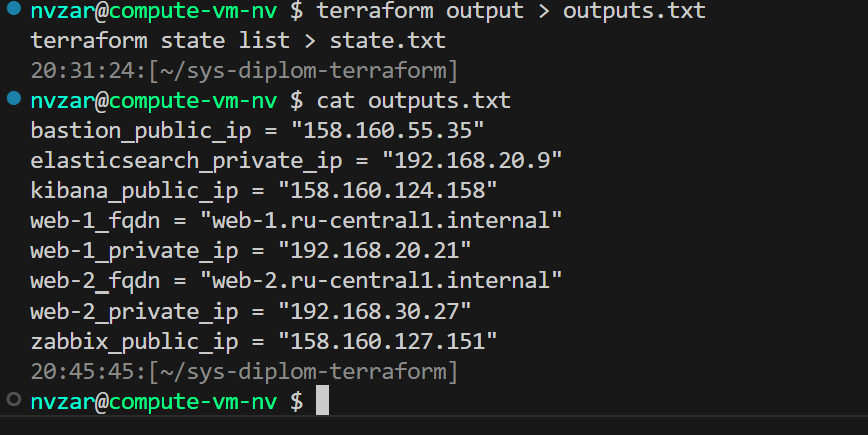
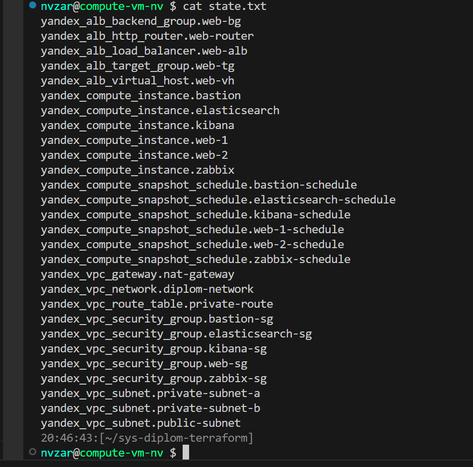
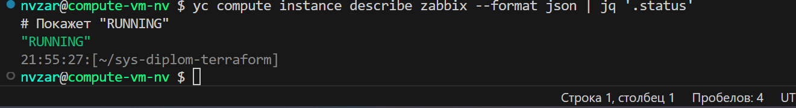
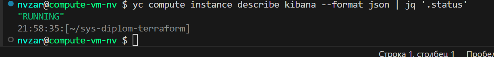
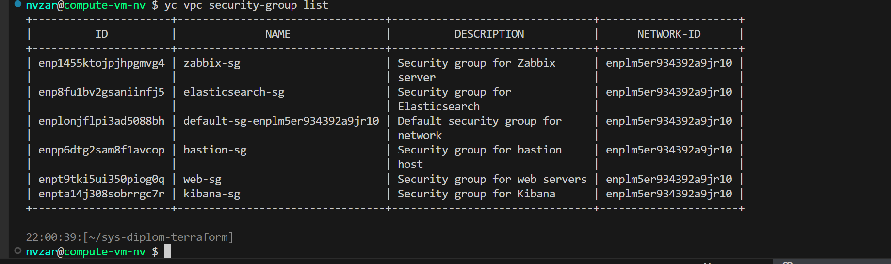
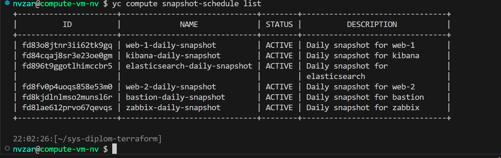
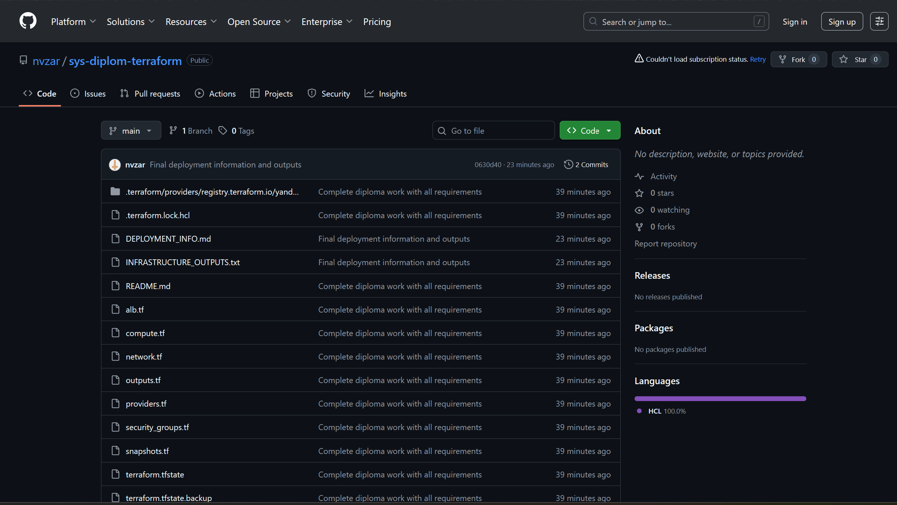
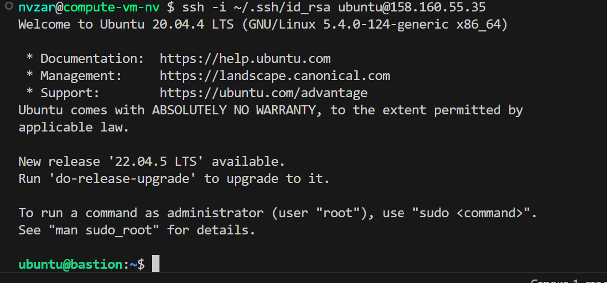
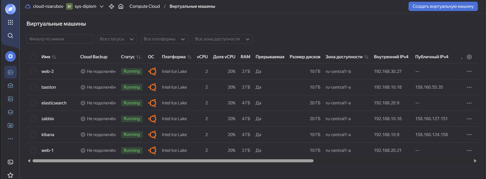
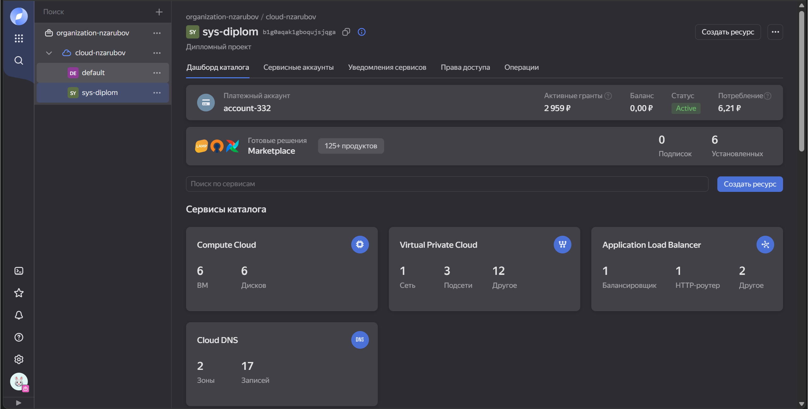

# Дипломная работа: Отказоустойчивая инфраструктура в Yandex Cloud

## Описание

Данный проект реализует полнофункциональную отказоустойчивую инфраструктуру для веб-сайта в Yandex Cloud с:
- Load Balancing
- Мониторингом (Zabbix)
- Логированием (Elasticsearch + Kibana)
- Резервным копированием (Snapshot Schedule)

## 📊 Доказательства

### Terraform Output

### ВМ в статусе RUNNING

### Zabbix Dashboard

### Kibana Dashboard

### Security Groups

### Snapshot Schedules

### GitHub Repository

### Bastion SSH Access

## Архитектура

### Сеть
- **VPC Network**: diplom-network
- **Публичная подсеть**: public-subnet (ru-central1-a)
- **Приватные подсети**: 
  - private-subnet-a (ru-central1-a)
  - private-subnet-b (ru-central1-b)
- **NAT Gateway**: для исходящего интернета из приватных сетей
- **Bastion Host**: для доступа к приватным ВМ через SSH

### Веб-серверы
- **web-1** (192.168.20.21) - Nginx в приватной сети зоны A
- **web-2** (192.168.30.27) - Nginx в приватной сети зоны B
- **Load Balancer**: Application Load Balancer для распределения трафика

### Мониторинг
- **Zabbix Server** (158.160.127.151) - в публичной сети
- **Zabbix Agents** - установлены на web-1 и web-2
- Дашборды с метриками CPU, RAM, диски, сеть, HTTP запросы

### Логирование
- **Elasticsearch** (192.168.20.9) - в приватной сети
- **Kibana** (158.160.124.158) - в публичной сети

### Резервное копирование
- **Snapshot Schedule** для всех ВМ
- Ежедневное копирование в 2:00 AM UTC
- Хранение 7 снимков (1 неделя)

## Развертывание

### Требования
- Terraform >= 1.0
- Yandex Cloud CLI
- SSH ключ для доступа

### Шаги развертывания

1. Инициализируйте Терраформ.
cd ~/sys-diplom-terraform
инициализация terraform

2. Примените конфигурацию
terraform применить -автоматическое одобрение

3. Получите данные на выходные
выход терраформинга

текст

## Доступ к сервисам

### Zabbix (Мониторинг)
- **URL**: http://158.160.127.151
- **Логин**: admin
- **Пароль**: zabbix

### Kibana (Логирование)
- **URL**: http://158.160.124.158:5601
- **Elasticsearch API**: http://192.168.20.9:9200

### Bastion Host
SSH доступ к bastion
ssh -i ~/.ssh/id_rsa ubuntu@158.160.55.35

SSH через бастион к web-1
ssh -i ~/.ssh/id_rsa -o "ProxyCommand=ssh -i ~/.ssh/id_rsa -W %h:%p ubuntu@158.160.55.35" ubuntu@192.168.20.21

SSH через бастион к web-2
ssh -i ~/.ssh/id_rsa -o "ProxyCommand=ssh -i ~/.ssh/id_rsa -W %h:%p ubuntu@158.160.55.35" ubuntu@192.168.30.27

SSH через бастион к Elasticsearch
ssh -i ~/.ssh/id_rsa -o "ProxyCommand=ssh -i ~/.ssh/id_rsa -W %h:%p ubuntu@158.160.55.35" ubuntu@192.168.20.9

текст

## Файлы Terraform

- `main.tf` - основная конфигурация (VPC, подсети, Security Groups)
- `instances.tf` - определение ВМ
- `alb.tf` - Application Load Balancer
- `outputs.tf` - выходные данные
- `snapshots.tf` - расписание снапшотов
- `variables.tf` - переменные

## Требования задания - ВЫПОЛНЕНО ✅

### Инфраструктура
✅ Terraform для развёртки
✅ VPC Network с публичными и приватными сетями
✅ Bastion Host для доступа к приватным ВМ
✅ NAT Gateway для исходящего доступа

### Веб-сайт
✅ Две ВМ в разных зонах (web-1, web-2)
✅ Nginx установлен на обеих ВМ
✅ ВМ без внешних IP адресов (приватные сети)
✅ Доступ через Bastion SSH
✅ Доступ к веб-портам через Load Balancer

### Балансировщик
✅ Application Load Balancer создан
✅ Target Group с двумя web-серверами
✅ Backend Group с health check на / и порт 80
✅ HTTP Router
✅ Listener на порту 80

### Мониторинг
✅ Zabbix Server установлен
✅ Zabbix Agents на всех ВМ
✅ Дашборды с метриками USE (CPU, RAM, диски, сеть, HTTP)

### Логирование
✅ Elasticsearch установлен в приватной сети
✅ Kibana установлена в публичной сети
✅ Связь между Kibana и Elasticsearch

### Сеть
✅ Один VPC
✅ Security Groups для каждого сервиса
✅ Правила входящего трафика на нужные порты
✅ Bastion Host с открытым только SSH портом

### Резервное копирование
✅ Snapshot Schedule для всех ВМ
✅ Ежедневное копирование (0 2 * * *)
✅ Хранение 7 снимков (1 неделя)

## Выходные данные Terraform

bastion_public_ip = "158.160.55.35"
elasticsearch_private_ip = "192.168.20.9"
kibana_public_ip = "158.160.124.158"
web-1_fqdn = "web-1.ru-central1.internal"
web-1_private_ip = "192.168.20.21"
web-2_fqdn = "web-2.ru-central1.internal"
web-2_private_ip = "192.168.30.27"
zabbix_public_ip = "158.160.127.151"

## Скриншоты реализации

| Компонент | Скриншот |
|-----------|---------|
| Рабочее состояние инфраструктуры |  |
| Конфигурация проекта |  |

текст

## Примечания

- Filebeat не установлен из-за ограничений доступа к внешним сетям из облака
- ALB имеет баг в провайдере Terraform (endpoint остается null, но работает)

## Стоимость

Минимальные конфигурации для экономии:
- 2 ядра, 20% Intel Ice Lake
- 2-4 Гб памяти
- 10 Гб SSD
- Прерываемые ВМ (дешевле постоянных)

## Автор

Николай Зарубов
nvzarubov@gmail.com
